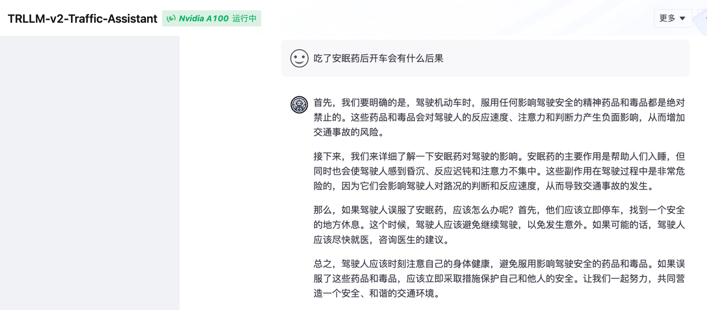

<!-- PROJECT LOGO -->
<div align="center">
  <a href="https://github.com/lindsey-chang/TRLLM-Traffic-Rules-Assistant">
    
  </a>
</div>

<!-- PROJECT SHIELDS -->
<!-- PROJECT SHIELDS -->
<span>&nbsp;&nbsp;</span>
<span>
&nbsp;&nbsp;</span>
<span>
&nbsp;&nbsp;</span>
<span>
&nbsp;&nbsp;</span>
<span>
&nbsp;&nbsp;</span>
<span>&nbsp;&nbsp;</span>


<p>
<b>TRLLM</b> 是一款可以作为车载应用平台上的交规小助手，它专注于回答用户关于交通法规、道路驾驶技能以及机动车驾驶证考核内容。</br>
对于有意向考取驾驶证的同学，<b>TRLLM</b>是不可或缺的选择。我们的TRLLM以科目一考题、科目四考题、公安部与国务院发布交通法规和科目二科目三教学视频文本为数据集来源，为想深入了解交通法规的同学提供了专业支持。
</p>

---

##  Framework


##  Achievement
项目荣获上海人工智能实验室举办的2024浦源大模型系列挑战赛春季赛前50强


---

##  Features

- [**经过筛选的高质量结构化交通知识数据集**](./dataset/)
  ：我们的数据集包含了科目一和科目四的题库，对原始题库，我们进行了一系列的JSON结构化（`TRLLM-v1`
  的训练数据集）。为了进一步提高数据集的质量，我们利用现有商业大模型api对数据集进行了扩展。这一扩展使得数据更加贴近人类提问的语言习惯，并确保问题的逻辑前后语序更为连贯（`TRLLM-v2`
  的训练数据集）。另外，我们还生成了自我认知数据集。根据另一份只有答案没有解析的科目一科目四选择题题库，自制了客观评测数据集，用于评测比较TRLLM与InternLM2-chat-7B在交通知识上的客观推理能力。用于微调和评测的数据集分开制作没有交叉，确保评测结果真实可靠。
- [**有监督微调**](./finetune/)
  ：基于上述三种数据集，我们以InternLM2-chat-7B为基座模型进行了有监督微调。TRLLM-Model-v1是基于科目一科目四题库解析、自我认知数据集的。TRLLM-Model-v2是基于商业大模型api扩展数据集和自我认知数据集的。
- [**检索增强生成**](./rag/):
  我们建立了一个向量数据库，其中包含有关《中华人民共和国公安部令》和《中华人民共和国国务院令》的相关交通法规，以及机动车驾驶证考核相关的资料，流程，以及诀窍。基于langchain技术，我们构建了一个多查询混合搜索的检索架构，以提高信息检索的准确性以多样性。
- [**量化模型**](./quant/)：我们使用LMDeploy工具对微调后的模型进行W4A16量化和KV Cache量化，以在实际部署中降低模型的显存开销和提高模型的运行效率。
- [**客观评测**](./evaluation/)：我们使用OpenCompass对模型进行了客观评测，考察其在科目一和科目四考试题库下做选择题`MCQ`
  的准确性，同时对比较了TRLLM-Model的4个不同的版本`TRLLM-v1`、`TRLLM-v2`、`TRLLM-v1-4bit`量化版本、`TRLLM-v2-4bit`
  量化版本和`InternLM-chat-7b`在我们自制的评测数据集上的准确率表现，从而评估TRLLM基于交通知识进行微调的效果，并判断这4种TRLLM-Model哪一个准确率最高，可以部署在生产应用场景。
  **经过客观评测，我们得出了`TRLLM-v2`的准确率最高**。

## Released Models

| Model                                                                                                                                                                                                                                                       | Introduction                                                                                                                                                                                                                               |
|:------------------------------------------------------------------------------------------------------------------------------------------------------------------------------------------------------------------------------------------------------------|:-------------------------------------------------------------------------------------------------------------------------------------------------------------------------------------------------------------------------------------------|
| **TRLLM-v1** <a href="https://modelscope.cn/models/LindseyChang/TRLLM-Model/summary">           </a>                                                                                                                  | 基于基座模型InternLM2-chat-7B在[llm_conversation_dataset_merge_random_v1.json](./dataset/json/finetune_json/llm_conversation_dataset_merge_random_v1.json) 数据集（包括科目一科目四带解释版题库和自我认知数据集，打乱顺序后混合而成）上进行微调，为了增加数据量将相同数据复制了10遍，共「40468」条数据，训练一个批次。      |
| **TRLLM-v1-4bit**                  <a href="https://www.modelscope.cn/models/heitao5200/TRLLM-Model-4bit/summary">     </a>                                                                                           | 基于TRLLM-v1进行W4A16量化。                                                                                                                                                                                                                       |
| **TRLLM-v2** <a href="https://modelscope.cn/models/LindseyChang/TRLLM-Model-v2/summary"></a>    <a href="https://openxlab.org.cn/models/detail/Lindsey/TRLLM-Model-v2"></a> | 基于基座模型InternLM2-chat-7B在[llm_conversation_dataset_merge_random_new.json](./dataset/json/finetune_json/llm_conversation_dataset_merge_random_new.json)数据集（包括科目一科目四带解释版题库、基于商业大模型改进output表述的数据集、和自我认知数据集，打乱顺序后混合而成）上进行微调，共「33834」条数据，训练三个批次。 |
| **TRLLM-v2-4bit**                 <a href="https://www.modelscope.cn/models/heitao5200/TRLLM-Model-4bit_turbomind/summary">    </a>                                                                                   | 在TRLLM-v2-进行W4A16量化。                                                                                                                                                                                                                       |

---

## 如何体验本项目

关于各个版本的结果对比以及介绍，请移步到 [RAG](./rag/README.md)。

### 运行脚本说明：

`web_demo_ensemble_retriever.py` ：TRLLM-v2 (Ensemble Retriever) 

`web_demo_multi_retriever.py` : TRLLM-v2 (Multi Query Retriever Retriever)

`web_demo_agent.py` : 带有 [意图识别](./agents/README.md) 的 TRLLM-v2

`web_demo_turbomind_ensemble_retriever.py` : TRLLM-v2-4bit (Ensemble Retriever)

`web_demo_turbomind_multi_retriever.py` : TRLLM-v2-4bit (Multi Query Retriever Retriever)

如果需要使用 `internlm2-chat-7b` 作为基座模型运行 Ensemble Retriever 或者 Multi Query Retriever，可将 `web_demo_ensemble_retriever.py` 和 `web_demo_multi_retriever.py` 里的模型路径换成 `internlm2-chat-7b` 的模型路径。


### 1. 克隆本项目到您的本地开发机上

```bash
git clone https://github.com/lindsey-chang/TRLLM-Traffic-Rules-Assistant.git
```

默认所有 web_demo 脚本运行的都是 TRLLM-v2 模型，可根据提供的模型下载链接自行下载替换不同版本的模型。

#### 配置环境

```bash
conda env create --name trllm --file=environment.yml
conda activate trllm
pip install -r requirements.txt
python download_turbomind.py
```

#### 启动 Streamlit

```bash
streamlit run web_demo_ensemble_retriever.py --server.address 127.0.0.1 --server.port 6006
```

### 2. 在OpenXlab上体验本项目

[TRLLM-v2-Traffic-Assistant (Ensemble Retriever)](https://openxlab.org.cn/apps/detail/tackhwa00/TRLLM-v2-Traffic-Assistant)

[TRLLM-v2-4bit-Traffic-Assistant (Ensemble Retriever)](https://openxlab.org.cn/apps/detail/tackhwa00/TRLLM-v2-W4A16-Traffic-Assistant)


#### 如果你想部署我们在OpenXlab上的项目
[请看Demo](./demo)

#### 运行结果摘要

可以在左侧设置是否开启RAG




### 3. Xtuner chat体验微调后的模型

以下是使用Xtuner chat直接测试发布在Model Scope上的TRLLM-v2模型。

#### 运行结果摘要


---

## TRLLM-Traffic-Rules-Assistant 项目构建逻辑

### 数据构建
#### 1. RAG数据集
#### 2. 指令跟随微调数据集
#### 3. 自制评测数据集

### 微调指南


#### 1. 基于internml2-chat-7b进行QLoRA微调，使用指令跟随数据集`llm_conversation_dataset_merge_random_v1.json`，迭代1个批次，在1/4A100上耗时约4小时。

#### ２. 基于internml2-chat-7b进行QLoRA微调，使用**增强**后的指令跟随数据集`llm_conversation_dataset_merge_random_new.json`，迭代3个批次，在1/4A100上耗时约8小时。
### 量化部署

#### 1. W4A16 量化

- 计算 minmax
- 量化权重模型
- 量化后的模型转换成turbomind 格式
- 启动W4A16量化后的模型

#### 2. KV Cache 量化

- 转换原始模型格式
- 计算 minmax 
- 获取量化参数(注意此时是把结果放到 turbomind的模型weight目录下)
- 修改参数
- 启动kvcache量化之后的模型

#### 3. W4A16 量化 + KV Cache 量化

- 获取量化参数(注意此时是把结果放到 W4A16 量化turbomind的模型weight目录下)
- 启动W4A16+kvcache模型

### 评测分析
自制的客观评测数据集：[mcq_data.jsonl](./dataset/json/eval_jsonl/mcq_data.jsonl)

| 模型名称                   | 内存占用(MiB) | 显存占用(MiB) | opencompass测评 | 优化点                        |
|------------------------|-----------|-----------|---------------|----------------------------|
| internlm2-chat-7b      | 15        | 15031     | 58.37         | 基座模型                       |
| TRLLM-Model-v1         | 29        | 15273     | 67.46         | 线下收集的数据集微调                 |
| TRLLM-Model-v2         | 29        | 16103     | 69.83         | 线下收集的数据集+ 商业大模型进行数据扩展 微调   |

- 每次评测后的相应模型的准确率不是和上一次完全一样的，而是会浮动的。
- 基于各种交通规则数据进行微调的TRLLM-Model-v1和TRLLM-Model-v2表现均比基座模型有一定的提升，说明我们的微调是有效的。
- TRLLM-Model-v2在客观评测中准确率比TRLLM-Model-v1高，说明我们基于商业大模型增强数据集语言表述连贯性的方案对模型性能提升是有效的。


### 问题思考
#### 1. 关于客观评测结果
- TRLLM-Model-v1和TRLLM-Model-v2虽然在基于科目一科目四选择题客观评测上得分比基座模型高，但是仍然远远不够人类科目一、科目四考试及格要求的准备率。
- 作为一个能给用户带来帮助的车载助手，对于正确的输出交规知识格外重要，TRLLM对于模型的客观性在应用场景上有着超高的要求。
- 初步分析，是指令跟随训练数据集中"output"属性是`关键答案+解释`的结构，而解释又由`答题口诀+理由+相关法规条例`等内容组成。对于客观评测来说，`关键答案`是能提升这一分数的最重要的数据部分，但它和其他数据组合在一起，怀疑TRLLM对`关键答案`的重要性理解不足。
- 因此，我们认为，**数据集仍需进一步分解，生成让大模型更容易理解的训练数据集。**
- 要是算力充足，感觉可以实施**大小模型协同**的结构。小模型负责给出准确的结果，大模型负责根据小模型的答案生成友善的、有逻辑的解释。

#### 2. 关于有时TRLLM面对一些无效的提问时，模型依然在解释交通规则。
比如输入：空白的内容` `；无意义的符号`>。`等。造成了数据安全问题和隐私泄漏的风险。


- 考虑增强System Prompt和改进身份认知数据集的"output"，之前的Prompt和身份认知一味的强调帮助用户的小助手态度。
- 但在面对恶意用户或风险用户时，也要让TRLLM明白自己有说不的权利。

## Reference

1. [https://www.rungalileo.io/blog/optimizing-llm-performance-rag-vs-finetune-vs-both](https://www.rungalileo.io/blog/optimizing-llm-performance-rag-vs-finetune-vs-both)
2. [https://github.com/InternLM/tutorial](https://github.com/InternLM/tutorial)

---

## 后记

### TRLLM形象生成
项目LOGO由DALL·E和[logo.com](logo.com)生成:

- Prompt:

> I want a logo for a github project called Traffic-Rules-Assistant.
>
> I want it to look minimal and tech-based. It should be clear enough to be legible in a small profile avatar. Please
> make the logo fit within a circle. The border of the circular logo represents the steering wheel, and the interior of
> the circular logo draws a robot to represent the large language model (There should be more emphasis on the features
> of
> the steering wheel, and the robot can just be represented figuratively with sketch lines). Use the colors black and
> variations of blue for the circular logo, and the background color should be clean white.
>
> The main logo should just contain the letters: "TRLLM".  "TRLLM" needs to be directly below the circular logo!!! Both
> the circular LOGO and the "TRLLM" text should be centered in the vertical direction (y-axis direction).

## Star History
[](https://star-history.com/#lindsey-chang/TRLLM-Traffic-Rules-Assistant&Date)
## Stats
[](https://github.com/lindsey-chang/TRLLM-Traffic-Rules-Assistant)
## 特别鸣谢
- 所有贡献者
- [书生·浦语](https://internlm.intern-ai.org.cn/)
- [上海人工智能实验室](https://www.shlab.org.cn/)
## 项目贡献者
<a href="https://github.com/lindsey-chang/TRLLM-Traffic-Rules-Assistant/graphs/contributors">
  
</a>
