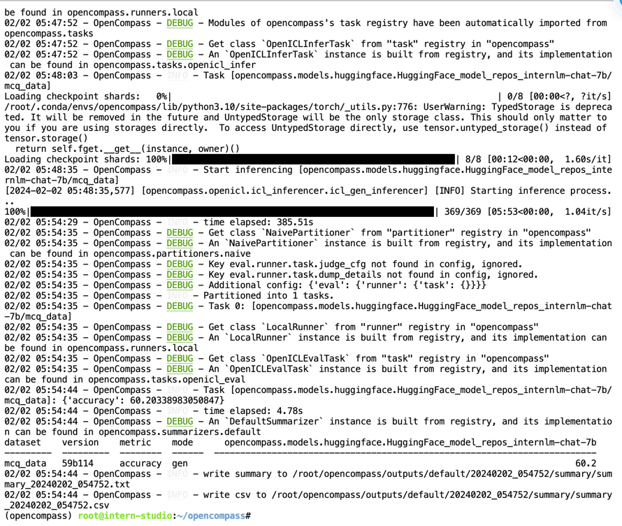
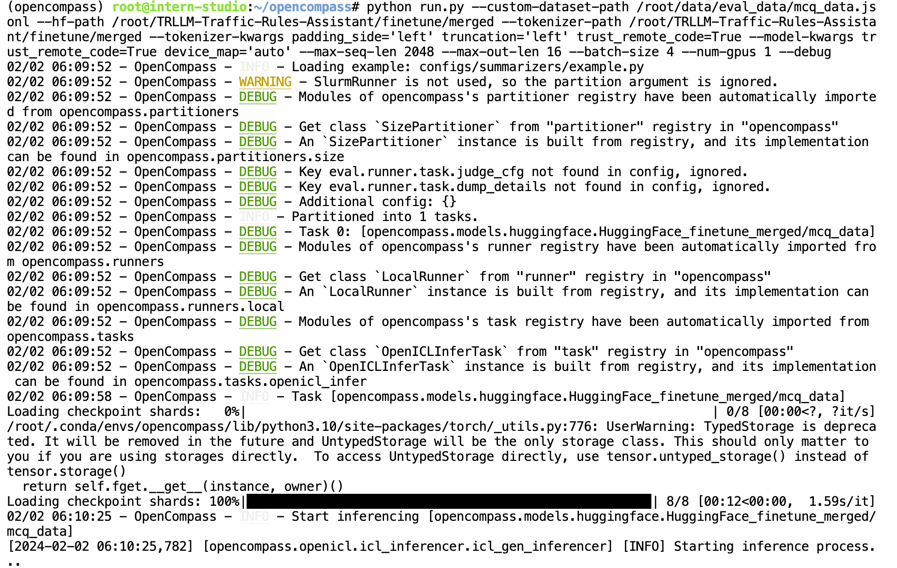

# 基于自定义数据集对TRLLM进行评测

自定义数据集格式以及利用opencampass进行评测，参考文档：[https://opencompass.readthedocs.io/zh-cn/latest/advanced_guides/custom_dataset.html](https://opencompass.readthedocs.io/zh-cn/latest/advanced_guides/custom_dataset.html)

## 评测环境配置

```bash
conda activate opencompass 
cd ~
(opencompass) root@intern-studio:~# cd opencompass/
```

## 客观评测

TRLLM作为交规小助手，对于交通规则理解的正确性和客观性是非常重要的。本小结旨在比较经过微调后的领域大模型TRLLM对于基座模型究竟在客观评测的评分方面有无提升，从而判断微调流程是否有效。

### 基座模型`internlm-chat-7b`

```
python run.py --custom-dataset-path /root/data/eval_data/mcq_data.jsonl --hf-path /share/temp/model_repos/internlm-chat-7b/ --tokenizer-path /share/temp/model_repos/internlm-chat-7b/ --tokenizer-kwargs padding_side='left' truncation='left' trust_remote_code=True --model-kwargs trust_remote_code=True device_map='auto' --max-seq-len 2048 --max-out-len 16 --batch-size 4 --num-gpus 1 --debug
```

> python run.py \
> --custom-dataset-path /root/data/eval_data/mcq_data.jsonl \ #自制的选择题问答形式的评测数据集
> --hf-path /share/temp/model_repos/internlm-chat-7b/ \ # HuggingFace格式的模型的路径-此处为基座大模型的路径
> -此处测评基座模型`internlm-chat-7b`
> --tokenizer-path /share/temp/model_repos/internlm-chat-7b/ \ # HuggingFace tokenizer 路径（如果与模型路径相同，可以省略
> --tokenizer-kwargs padding_side='left' truncation='left' trust_remote_code=True \ # 构建 tokenizer 的参数
> --model-kwargs trust_remote_code=True device_map='auto' \ # 构建模型的参数
> --max-seq-len 2048 \ # 模型可以接受的最大序列长度-模型读入数据的最大长度
> --max-out-len 16 \ 生成的最大 token 数-模型response出来的最大长度-设置为较短的16后，保证做客观题时不会吐出特别长的文本，从而有更好的指令跟随能力
> --batch-size 4 \ # 批量大小
> --num-gpus 1 \ # 运行模型所需的 GPU 数量
> --debug # 所有的打印都会出现在终端

- Insern Studio开发机上的运行截图：
  
  

- **评测结果**：

| dataset  | version | metric   | mode | opencompass.models.huggingface.HuggingFace_model_repos_internlm-chat-7b |
|----------|---------|----------|------|-------------------------------------------------------------------------|
| mcq_data | 59b114  | accuracy | gen  | 60.2                                                                    |

由此可知，`internlm-chat-7b`进行驾考科目一、科目四选择题MCQ评测的准确率为**60.2%**。

## 微调模型`TRLLM`-v1版本

`TRLLM`-v1版本是使用未经过商业api改进数据集（`llm_conversation_dataset_merge_random_v1.json`）output语言连贯程度的微调模型。

```bash
python run.py --custom-dataset-path /root/data/eval_data/mcq_data.jsonl --hf-path /root/TRLLM-Traffic-Rules-Assistant/finetune/merged --tokenizer-path /root/TRLLM-Traffic-Rules-Assistant/finetune/merged --tokenizer-kwargs padding_side='left' truncation='left' trust_remote_code=True --model-kwargs trust_remote_code=True device_map='auto' --max-seq-len 2048 --max-out-len 16 --batch-size 4 --num-gpus 1 --debug
```

> python run.py \
> --custom-dataset-path /root/data/eval_data/mcq_data.jsonl \
> --hf-path /root/TRLLM-Traffic-Rules-Assistant/finetune/merged \ # 此处为TRLLM-v1的路径
> --tokenizer-path /root/TRLLM-Traffic-Rules-Assistant/finetune/merged \
> --tokenizer-kwargs padding_side='left' truncation='left' trust_remote_code=True \
> --model-kwargs trust_remote_code=True device_map='auto' \
> --max-seq-len 2048 \
> --max-out-len 16 \
> --batch-size 4 \
> --num-gpus 1 \
> --debug




- **评测结果**：

| dataset  | version | metric   | mode | opencompass.models.huggingface.HuggingFace_finetune_merged |
|----------|---------|----------|------|------------------------------------------------------------|
| mcq_data | 59b114  | accuracy | gen  | 65.83                                                      |

由此可知，`TRLLM-v1`进行驾考科目一、科目四选择题MCQ评测的准确率为**65.83%**。

因此，在基座模型`internlm-chat-7b`上基于数据集`llm_conversation_dataset_merge_random_v1.json`（包含的40468条数据）进行微调，可以使得微调后的数据集在基于驾考科目一科目四题库构建的MCQ客观评测上，**提高5.83%的准确率**！

这说明，微调对基座模型在驾考科目一科目四考试答题的**准确率**表现上有着较明显的**提升**。

> `mcq_data.jsonl` 与微调数据集`llm_conversation_dataset_merge_random_v1.json`是分开构建的，未有数据泄漏问题，构建过程详见[微调数据集构建流程](../dataset/README.md)。