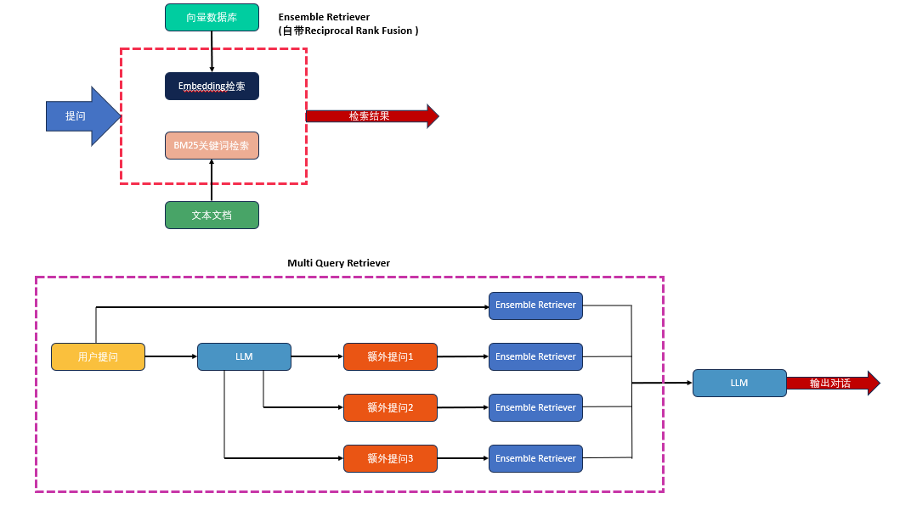
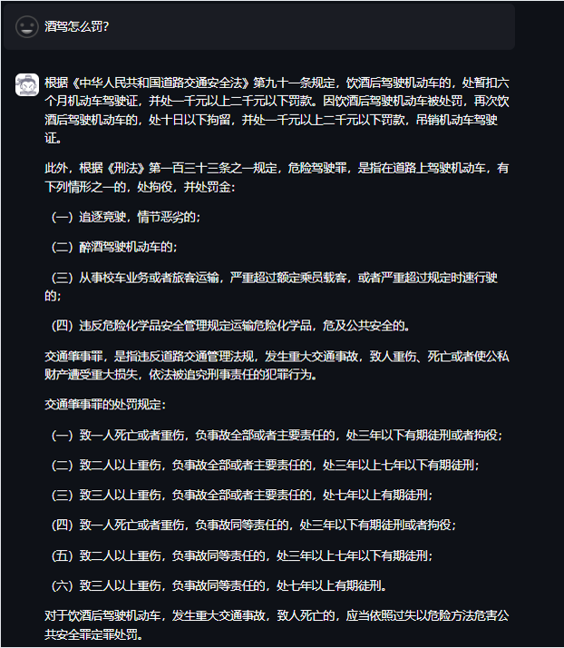
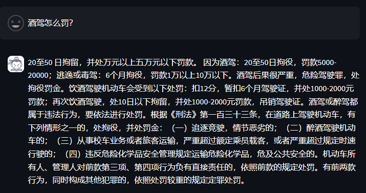
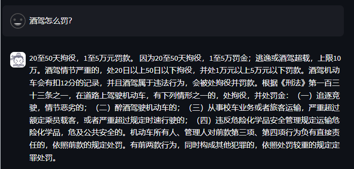
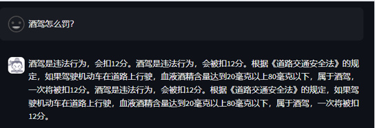

# RAG架构

上图展示了本项目采用的RAG架构。首先，通过提示方式，LLM将根据用户提问生成3个额外的相关问题（Multi Query
Retriever）。总计4个问题将经过向量检索和关键词检索（Ensemble
Retriever），检索到的文档将被返回给LLM，以便对用户提出的问题进行更详细的回答，尤其是在法规方面。这一设计旨在确保LLM的输出回答涵盖更多细节。

## 生成Prompt

上图显示了用于引导模型生成额外提问的prompt。

上图展示了针对用户提问 “酒驾怎么罚？” 生成的额外3个提问。

## 结果对比

- **基于 internlm2-chat-7b 为基座模型对比 Ensemble Retriever 和 Multi Query Retriever**：

| Ensemble Retriver                             | Multi Query Retriever                           |
|-----------------------------------------------|-------------------------------------------------|
|  |  |

  经过对比发现，Multi Query Retriever相较于Ensemble Retriever更能输出详尽的法规细节。然而，这取决于Multi Query
Retriever输出的额外提问。在额外提问偏离主题的情况下，Ensemble
Retriever的性能可能更为出色。这强调了基座模型对prompt理解和关联相关提问的能力的重要性。实验证明，在某些情况下，7B模型生成的额外提问会偏离主题。

- **基于 TRLLM-v2 为基座模型对比 Ensemble Retriever 和 Multi Query Retriever**：

| TRLLM-v2                                                  | TRLLM-v2 + Ensemble Retriver                  | TRLLM-v2 + Multi Query Retriever                |
|-----------------------------------------------------------|-----------------------------------------------|-------------------------------------------------|
|  |  |  |

  原生TRLLM-v2和使用Ensemble Retriever时的结果相似，而Multi Query
  Retriever在TRLLM-v2上能够提供一些额外信息，但整体差距不大。经过测试发现，TRLLM-v2的知识覆盖了RAG输出的知识，也就是说，当启用RAG时，如果用户提出的问题超出了
  TRLLM-v2 的知识范围，但在 RAG
  涵盖的领域内，模型也无法回答该问题。简言之，RAG的作用主要是为TRLLM-v2的输出添加一些细节（取决于输出额外提问的关联性以及多样性），有时甚至没有。此外，正如图中所示，TRLLM-v2存在不受prompt影响的情况，原本应该输出额外提问变成输出了答案。综上所述，TRLLM-v2可能存在过拟合的现象。

- **基于 TRLLM-v2-4bit（量化后的TRLLM-v2） 为基座模型对比 Ensemble Retriever 和 Multi Query Retriever**：

| TRLLM-v2-4bit                                       | TRLLM-v2-4bit + Ensemble Retriver             | TRLLM-v2-4bit + Multi Query Retriever           |
|-----------------------------------------------------|-----------------------------------------------|-------------------------------------------------|
|  |  |  |

启用RAG后，观察到与 TRLLM-v2-4bit 的输出稍有不同。这种现象可能是由于量化后的模型在应对过拟合情况时略有改善。然而，基于量化后的TRLLM-v2-4bit表现显著下降，而RAG的性能则非常依赖于基座模型，导致RAG输出的结果并不理想。

## 总结

如果想询问跟交通法规相关的建议使用基于 internlm2-chat-7b 为基座模型的 Multi Query Retriever，
这是因为rag数据集收集了相对全面的法规，而且微调后的模型存在知识覆盖的情况。反之如果想询问驾考方面推荐使用
TRLLM-v2 + Multi Query Retriever （取决于生成的额外问题, 表现有时候不太稳定)。

## 未来工作

- 尝试权重调整：在生成过程中调整分配给LLM和RAG组件的相对权重，以找到适用于您特定用例的最佳平衡。

- 建立更好的分块方案：通过对文本和向量数据库引入元信息，实现分层索引，类似树结构，以更有效地区分和组织数据。

